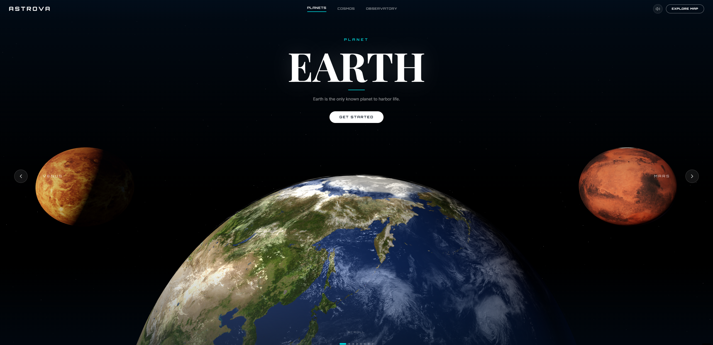
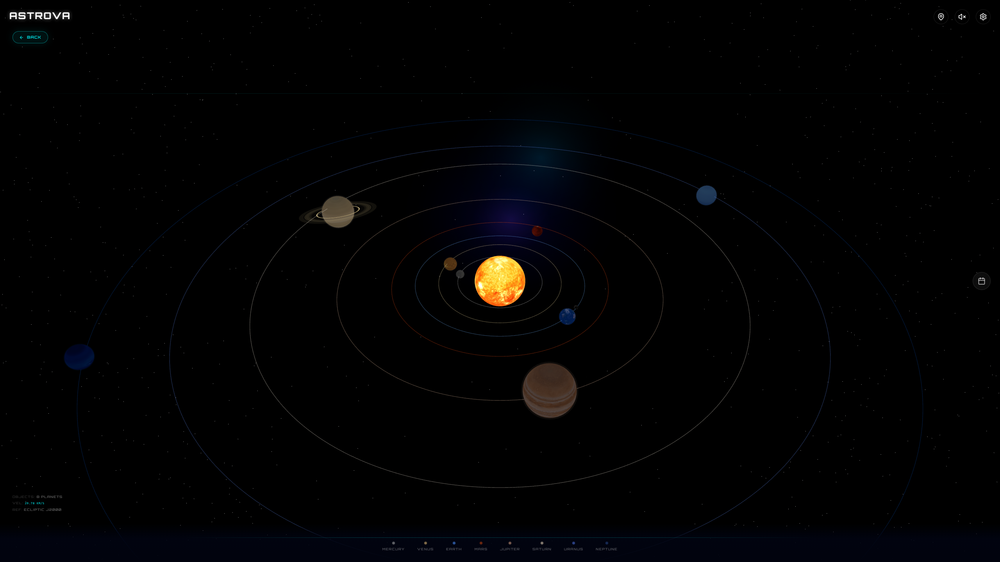

<div align="center">

# Astrova
*The cosmos, at your fingertips.*



[](https://react.js.org/)
[](https://www.typescriptlang.org/)
[](https://threejs.org/)
[](https://www.framer.com/motion/)
[](https://opensource.org/licenses/MIT)

[](https://YOUR_VERCEL_URL.vercel.app)

<!-- Add a GIF or screenshot here -->

</div>

## About Astrova

Astrova is an immersive 3D space exploration web experience built to evoke the feeling of wonder — like seeing the stars for the first time. It features an interactive solar system and a curated cinematic Observatory gallery. Using real NASA, ESA, Webb, and NOIRLab imagery and data, Astrova bridges the gap between scientific accuracy and breathtaking visual design.

---

## Features

### 🪐 Solar System
<ul>
  <li><b>All 8 planets</b> rendered in 3D with real NASA textures</li>
  <li><b>☀️ Animated Sun</b> with bloom glow effect</li>
  <li><b>🌙 Interactive Moon</b> phase navigator (full 29.5-day cycle)</li>
  <li><b>☄️ Real near-Earth asteroids</b> from the NASA NeoWs API</li>
  <li><b>🌍 "My Sky Tonight"</b> — ISS pass times, visible planets, meteor showers based on your location</li>
  <li><b>🎥 Cinematic planet zoom</b> with info panels and shocking facts</li>
</ul>



### 🔭 The Observatory
<ul>
  <li><b>🌌 Curated gallery</b> of the universe's most breathtaking phenomena</li>
  <li><b>🪐 Per-object 3D treatments:</b> nebula skybox, galaxy particle system, black hole lensing shader, supernova parallax, aurora ripple shader, pulsar beams</li>
  <li><b>✨ Custom GLSL shaders</b> for gravitational lensing and aurora wave distortion</li>
  <li><b>🖼️ Majestic sources:</b> James Webb Space Telescope, Hubble, NOIRLab, ESA</li>
  <li><b>🎞️ Cinematic fade-to-black</b> transitions between objects</li>
  <li><b>🗂️ Category filtering:</b> Nebulae, Galaxies, Black Holes, Supernovae, Star Clusters, Aurora, Pulsars</li>
</ul>


---

## Tech Stack

| Category | Technology | Purpose |
| :--- | :--- | :--- |
| **Framework** | React + TypeScript | Component architecture and type safety |
| **3D Rendering** | Three.js + React Three Fiber | WebGL scene management |
| **3D Helpers** | @react-three/drei | Stars, OrbitControls, useTexture |
| **Post-processing**| @react-three/postprocessing | Bloom, depth effects |
| **Animation** | Framer Motion + GSAP | UI transitions and camera animation |
| **Styling** | Tailwind CSS | Utility-first UI styling |
| **Shaders** | GLSL | Custom aurora ripple and gravitational lensing |
| **Image Proxy** | wsrv.nl | On-the-fly image resizing and format conversion |
| **Data** | NASA APOD API, NASA NeoWs | Live astronomical data |

---

## Getting Started

```bash
# Clone the repo
git clone https://github.com/YOUR_USERNAME/astrova.git

# Install dependencies
cd astrova
npm install

# Start development server
npm run dev
```

> **Note:** Requires a free NASA API key from [api.nasa.gov](https://api.nasa.gov/). Add it to a `.env` file as `VITE_NASA_API_KEY=your_key_here`

---

## Project Structure

```text
src/
├── components/
│   ├── solar-system/     # Planet, Sun, AsteroidBelt, MoonPhase
│   ├── observatory/      # ObservatoryScene, ObservatoryUI, treatments
│   └── ui/               # Navbar, panels, overlays
├── data/
│   └── observatory.ts    # Curated cosmic object collection
└── shaders/              # GLSL shader files
```

---

## Data Sources & Credits

- [NASA APOD API](https://apod.nasa.gov/apod/astropix.html) — apod.nasa.gov
- [NASA NeoWs API](https://api.nasa.gov/) — api.nasa.gov
- [NOIRLab Image Archive](https://noirlab.edu/public/images/) — noirlab.edu/public/images
- [ESA/Webb](https://esawebb.org/images/) — esawebb.org/images
- [Hubble Heritage](https://hubblesite.org/images/gallery) — hubblesite.org/images/gallery
- [Night Sky Panorama](https://noirlab.edu/public/images/iotw1941a/) — NOIRLab/NSF/AURA/E. Slawik

> *All astronomical images are used under their respective open-access licenses. Credits are displayed within the application for each object.*

---

## License

MIT License
